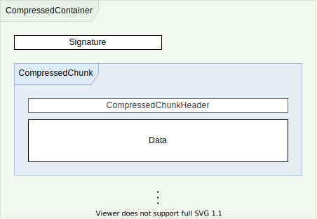
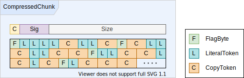

# Table of contents

1. [Introduction](#introduction)
1. [Overview](#overview)
1. [Details](#details)
1. [Invariants](#invariants)
1. [Implementation](#implementation)
1. [Random Thouhgts](#random-thoughts)

## Introduction

Several streams inside the binary VBAProject are stored as `CompressedContainer`s to preserve space. The compression algorithm is based on the *run-length encoding* ([RLE](https://en.wikipedia.org/wiki/Run-length_encoding)) technique.

The published documentation ([\[MS-OVBA\]: Office VBA File Format Structure](https://docs.microsoft.com/en-us/openspecs/office_file_formats/ms-ovba/575462ba-bf67-4190-9fac-c275523c75fc)) explains how to decode a `CompressedContainer`. The decoder algorithm descibed is rather complex, and appears to have been derived from an existing implementation, rather than the implementation following the specification.

As it turned out, the implementation can be simplified a lot, once the individual bits of information are put together to form a coherent view of the protocol. The following text starts with a high level overview, then works out the finer details, draws conclusions, and finally presents an almost trivial implementation of a decompressor. It concludes with a historic perspective that attempts to look behind the considerations that led to this protocol, and evaluates whether they still apply today.

## Overview

A `CompressedContainer` is a byte stream consisting of a signature byte (`0x01`) followed by a sequence of one or more `CompressedChunk`s.

Each `CompressedChunk` in turn starts with a 2-byte `CompressedChunkHeader` that encodes the chunk's raw binary size, a signature, and a flag indicating whether the chunk data is compressed or uncompressed1:

The `CompressedChunk`'s header is followed by a stream of bytes (`CompressedChunkData`) that contain either uncompressed data, or an array of `TokenSequence`, denoted by the compression flag stored in the header. When decompressing, uncompressed data is copied verbatim to the output stream.

A `TokenSequence` starts with a `FlagByte` followed by up to 8 tokens. Each bit in the `FlagByte` denotes one of two token types:

* A `LiteralToken` consists of a single byte. When decompressing, this byte is written to the output stream.
* A `CopyToken` is two bytes wide. It encodes offset and length information. When decompressing, the requested number of bytes starting at offset in the output stream are copied to the end of the output stream.

The following diagram illustrates  a `CompressedChunk`'s layout where the header's compression flag is set to `1`:

## Details

### `TokenSequence`

A `TokenSequence` starts with a `FlagByte` followed by up to 8 tokens. The individual bits of the `FlagByte`, starting from the least significant bit up to the most significant bit, encode the types of tokens following it:

* A `LiteralToken` is indicated by a bit value of `0b0`.
* A `CopyToken` is indicated by a bit value of `0b1`.

A `CopyToken` is two bytes wide. It encodes offset and length information. The offset is an index into the output stream relative to the current end of that stream. When decompressing, the respective number of bytes, starting at the specified offset, are copied to the end of the output stream2.

TODO: Add detailed descriptions (following is an sort-of complete list)

* Explain `CompressedContainer`'s layout (ultimately just the signature; maybe add statistics, i.e. 255 out of 256 possible values get rejected).
* Explain `CompressedChunk`'s layout, including:
  * Compression flag.
  * Signature (again, statistics; 3 bits, i.e. 8 possible bit combinations with 7 of those getting rejected)
  * Size (represents the entire chunk's size minus 3; 2 header bytes plus 1, the latter is required to store the maximum value of 212 given only 12 bits).
* Explain `TokenSequence`s, in particular how the partition point between offset/length moves as the decompressor's output stream grows.

## Invariants

TODO: Add derived/extrapolated algorithm invariants (may need to rethink terminology here), e.g. the fact that each chunk is decoded in isolation, reducing the amount of state required.

## Implementation

TODO: Present implementation, ideally using some sort of diagram.

## Random Thoughts

TODO: Informal information on why the format is the way it is:
* Simple (doesn't require much CPU)
* Likely invented at a time of ubiqutuous resource limitation; 4096 (page-sized) buffers everywhere (though it needs to be investigated, whether that has been the page size 'back in the day' as well).
* Fairly good compression on code, due to frequent use of the same character sequences (variable and function names). Each occurence can be represented in 2.125 bytes (`CopyToken` plus one bit in the `FlagByte`) regardless of the actual length. Compression ratio is roughly 2:1.
* Used to be stored in a binary .xls file that weren't otherwise compressed. This changed with the introduction of Office Open XML, where each document is ZIP-encoded by default.

### Happy accidents

* In an attempt to squeeze as much information as possible into any given space budget, the format specification accidentally made it impossible to encode impossible states (e.g. the size in a `CompressedChunk`s header).
* The chosen RLE scheme rewards developers using descriptive (or at least long-ish) symbol names. Though not strictly correct, this was a fun observation (a variable named `i` compresses down to anything in between 1 and 1.125 bytes; that's still less than the 2.125 bytes for any symbol of 3 characters and up).

---

1 *A `CompressedChunk` can wind up holding uncompressed data if the compression algorithm has determined that compressing the data doesn't yield any space savings.*

2 *The tail end of a `CopyToken` can reference data that only becomes available during the process of decompressing it (i.e. length is greater then the end-relative offset). Consider the sequence `AAAA` that can be encoded as a `LiteralToken` (the first `A`) followed by a `CopyToken` with offset 1 and length 3. When decompressing the `CopyToken` the output stream is only one byte long yet the token requests to copy three bytes. This turned out to be a real use case and needed to be addressed in the implementation.*